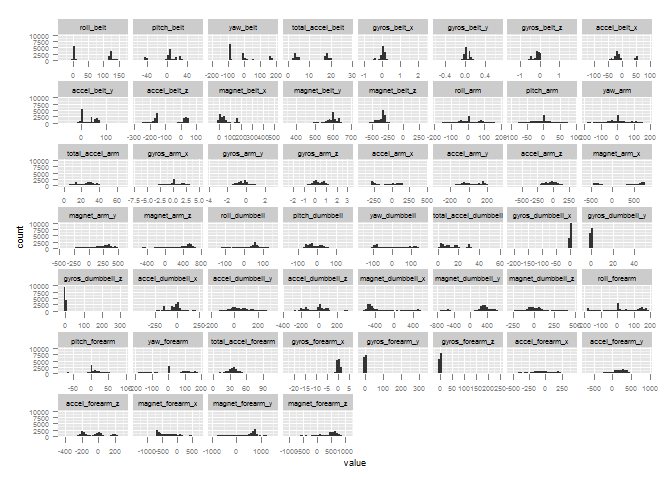
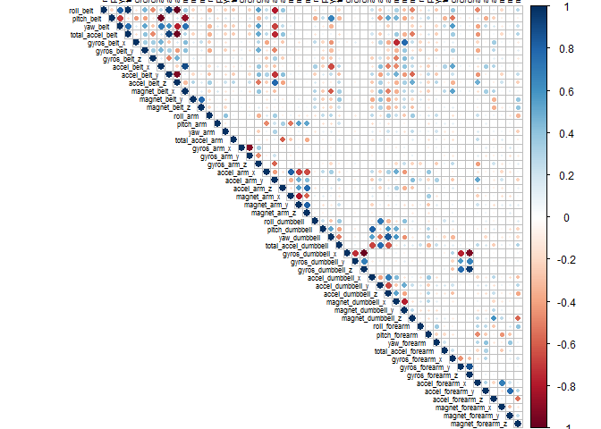
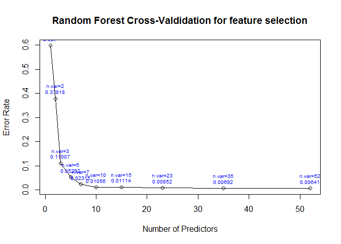

# Practical Machine Learning Assignment
Thomas Tsang  
Tuesday, February 17, 2015  

# Background

This report describes how I did build a model to predict the manner in which 
weight lifting exercises were performed. The goal is to achieve a predictive
model with an out of sample error rate (estimate) below 5%. The report explains 
all the steps followed including data acquisition, data cleaning, preliminary 
data exploration, model creation, model validation and out of sample error 
estimate. The final machine learning algorithm was then applied to the 20 test 
cases available in the testing dataset provided with the Practical Machine 
Learning Assignment, from the Coursera Practical Machine Learning (Data 
Scientist Track) course offered by the JHBSPH.

Six young health participants were asked to perform one set of 10 repetitions 
of the Unilateral Dumbbell Biceps Curl in five different fashions: exactly 
according to the specification (Class A), throwing the elbows to the front 
(Class B), lifting the dumbbell only halfway (Class C), lowering the dumbbell 
only halfway (Class D) and throwing the hips to the front (Class E).

Class A corresponds to the specified execution of the exercise, while the other 
4 classes correspond to common mistakes. Participants were supervised by an 
experienced weight lifter to make sure the execution complied to the manner 
they were supposed to simulate. The exercises were performed by six male 
participants aged between 20-28 years, with little weight lifting experience. 
We made sure that all participants could easily simulate the mistakes in a safe 
and controlled manner by using a relatively light dumbbell (1.25kg).

The dataset used in this assignment comes from the work of Velloso, E.; 
Bulling, A.; Gellersen, H.; Ugulino, W.; Fuks, H. on Qualitative Activity 
Recognition of Weight Lifting Exercises. Proceedings of 4th International 
Conference in Cooperation with SIGCHI (Augmented Human '13). Stuttgart, 
Germany: ACM SIGCHI, 2013 (Read more: 
http://groupware.les.inf.puc-rio.br/har#ixzz3S1OWExco). The data is licensed 
under the Creative Commons license (CC BY-SA) and so does this assignment.

# Step by Step Model Creation

Loading the libraries and dependent packages required across this work.


```
## Loading required package: caret
## Loading required package: lattice
## Loading required package: ggplot2
## Loading required package: reshape
## Loading required package: corrplot
## Loading required package: randomForest
## randomForest 4.6-10
## Type rfNews() to see new features/changes/bug fixes.
```

## Data Acquisition, Cleaning and Preliminary Exploration

Getting the training and testing datasets and checking their dimensions.


```r
# downloading training data and storing in data.frame named training
download.file(
        url = "http://d396qusza40orc.cloudfront.net/predmachlearn/pml-training.csv",
        destfile = "training.csv",mode="wb")
training <- read.csv("training.csv")

# showing dimensions of downloaded training dataset
dim(training)
```

```
## [1] 19622   160
```

```r
# downloading testing data and storing in data.frame named testing
download.file(
        url = "http://d396qusza40orc.cloudfront.net/predmachlearn/pml-testing.csv",
        destfile = "testing.csv",mode="wb")
testing <- read.csv("testing.csv")

# showing dimensions of downloaded testing dataset
dim(testing)
```

```
## [1]  20 160
```

Since it is large enough, 30% of the training dataset is left aside as a 
validation dataset to estimate the out of sample error of the final model.


```r
# setting a seed for reproducibility reason
set.seed(12345)                

# partitioning the data to keep aside 30% for validation purpose
inTrain <- createDataPartition(y=training$classe , p=0.7, list=FALSE)

# subsetting dataset for model training, and storing in variable named train
train <- training[inTrain,]

# subsetting validation dataset
validation <- training[-inTrain,]
```

Excluding all variables having NAs, all variables being incomplete and all 
variables with zero or near zero variance, as they are of limited use for 
predictive purpose.


```r
# removing all variables having NA
train <- train[,colSums(is.na(training))==0]

# showing dimensions of dataset
dim(train)
```

```
## [1] 13737    93
```

```r
# removing all variables being incomplete
train <- train[,colSums(train=="",na.rm = T)==0]

# showing dimensions of dataset
dim(train)
```

```
## [1] 13737    60
```

```r
# keeping only variables having variance
train <- train[,nearZeroVar(train,saveMetrics = TRUE)$zeroVar + 
                       nearZeroVar(train,saveMetrics = TRUE)$nzv == 0]

# showing dimensions of dataset
dim(train)
```

```
## [1] 13737    59
```

Removing any variables that are obviously not playing any role to predict how 
weight lifting exercises are being performed.


```r
# creating a vector of index of variables obviously not useful for prediction 
exclude <- which(names(train) %in% c("X","user_name","new_window",
                                     "raw_timestamp_part_1","raw_timestamp_part_2",
                                     "cvtd_timestamp","num_window"))

# subsetting the potential predictors
train <- train[,-exclude]

# showing dimensions of dataset
dim(train)
```

```
## [1] 13737    53
```

Creating histograms for each potential predictor to visualize their 
distribution and creating a correlation plot to spot any colinearity between 
the variables.


```r
# creating an histogram for each variable (excludinng last one which is the one to be predicted)
d <- melt(train[,-ncol(train)])
ggplot(d,aes(x = value)) + facet_wrap(~variable,scales = "free_x") + 
        geom_histogram() + theme(text = element_text(size=7))
```

 

```r
# creating correlation plot
corrplot(cor(train[,-ncol(train)]), type = "upper", tl.cex = 0.5, cl.cex=0.75, 
         tl.col = "black", pch.col="darkgrey")
```

 

The histograms reveal a wide range of distribution shapes, including multimodal 
ones and extremly skewed ones. We also see from the correlation plot that some 
variables are strongly correlated. That said, I chose to use a random forest 
algorithm, so that it is not not absolutely necessary to do any transformation 
of the variables. That algorithm should also pick first the most useful 
variables amongst the correlated ones (the one discriminating the data the
most at a given node).

## Model Creation and Validation

Random forest is usually one of the 2 top performing algotrithms along with 
boosting in prediction contest, and I would like to have a model as accurate as 
possible (I care more about the prediction accuracy than the interpretability 
of the model). I will also use cross-validation for feature selection (rfcv 
function from randomForest package) to avoid any overfitting of the model.


```r
# training random forests with cross-validation for feature selection 
rfcvModel <- rfcv(trainx = train[,-ncol(train)],
                  trainy = train[,ncol(train)],cv.fold=7, 
                  scale="log", step=0.666)

# plotting the error rates by number of predictors used in each random forest
plot(rfcvModel$n.var,rfcvModel$error.cv,
     xlab = "Number of Predictors",
     ylab = "Error Rate", 
     main="Random Forest Cross-Valdidation for feature selection",
     type = "o")
text(rfcvModel$n.var,rfcvModel$error.cv,paste0("n.var=",rfcvModel$n.var,"\n",round(rfcvModel$error.cv,5)),cex=0.6,pos=3,col="blue")
```

 

Based on the above plot, 10 predictors already give a small error rate and  
going beyond 10 predictors does not bring large marginal accuracy improvement, 
so I opt for a random forest model with the top 10 most important predictors 
based on Gini values.


```r
# training a random forest
rfModel <- randomForest(classe~.,data=train)

# getting predictors with Gini importance values
important <- importance(rfModel, sort = TRUE)

# sorting predictors by importance
important <- important[order(important, decreasing=TRUE),,drop = FALSE]

# subsetting the 10 most important predictors
finaltrain <- train[,rownames(important)[1:10]]

# training a random forest model (with only the 10 most important predictors)
finalModel <- randomForest(train$classe ~., data=finaltrain)
```

## Model Accuracy Evaluation

The validation dataset is used to check the accuracy of the final model. This 
step is not critical as random forest algotithm has built in bootstrapping, 
since each tree is built with different resampling of the original (training) 
dataset and each node is built from a random subset of the potential remaining 
features, hence the technique actually yields an unbiased estimate of the test 
set error.


```r
# using the final model to predict on the validation dataset 
predictions <- predict(finalModel,validation)

# getting confusion matrix
cm <- confusionMatrix(predictions,validation$classe)

# showing confusion matrix
cm
```

```
## Confusion Matrix and Statistics
## 
##           Reference
## Prediction    A    B    C    D    E
##          A 1663   14    2    0    0
##          B    9 1101   12    0    3
##          C    2   22 1008   12    2
##          D    0    2    3  952    5
##          E    0    0    1    0 1072
## 
## Overall Statistics
##                                           
##                Accuracy : 0.9849          
##                  95% CI : (0.9814, 0.9878)
##     No Information Rate : 0.2845          
##     P-Value [Acc > NIR] : < 2.2e-16       
##                                           
##                   Kappa : 0.9809          
##  Mcnemar's Test P-Value : NA              
## 
## Statistics by Class:
## 
##                      Class: A Class: B Class: C Class: D Class: E
## Sensitivity            0.9934   0.9666   0.9825   0.9876   0.9908
## Specificity            0.9962   0.9949   0.9922   0.9980   0.9998
## Pos Pred Value         0.9905   0.9787   0.9637   0.9896   0.9991
## Neg Pred Value         0.9974   0.9920   0.9963   0.9976   0.9979
## Prevalence             0.2845   0.1935   0.1743   0.1638   0.1839
## Detection Rate         0.2826   0.1871   0.1713   0.1618   0.1822
## Detection Prevalence   0.2853   0.1912   0.1777   0.1635   0.1823
## Balanced Accuracy      0.9948   0.9808   0.9873   0.9928   0.9953
```

## Conclusions and Evaluation on Testing Dataset

The final model's out of sample error estimate is 
1.5 % with a relatively narrow 95% CI, 
so it is within the initially stated accuracy goal, e.g. an error < 5%.

Finally, the machine learning algorithm is applied to the 20 test cases 
available in the testing dataset, and files are generated to submit the  
predictions in appropriate format to the programming assignment for automated 
grading.


```r
# applying final model on testing dataset and storing the answers
answers = as.character(predict(finalModel,testing))

# writing answers in individual file in a subfolder named submissions
subdir <- "submissions"
dir.create(file.path(".", subdir), showWarnings = FALSE)
n = length(answers)
for(i in 1:n){
        filename = paste0(subdir,"/problem_id_",i,".txt")
        write.table(answers[i],file=filename,quote=FALSE,row.names=FALSE,
                    col.names=FALSE)
}
```

